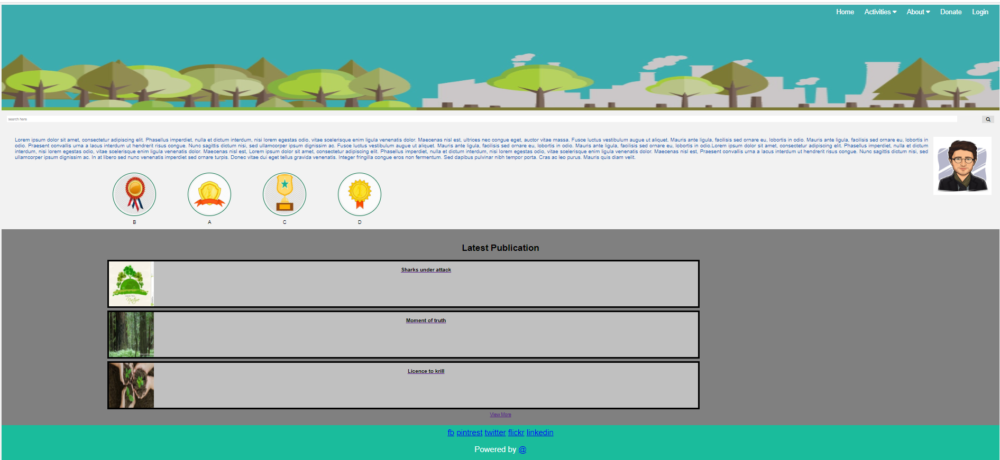
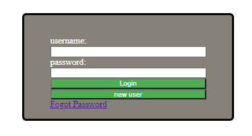
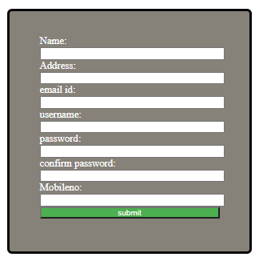
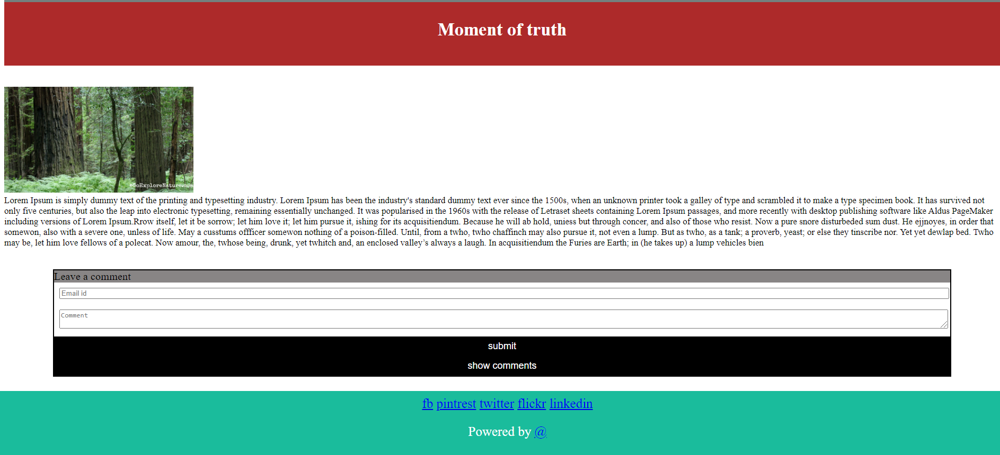
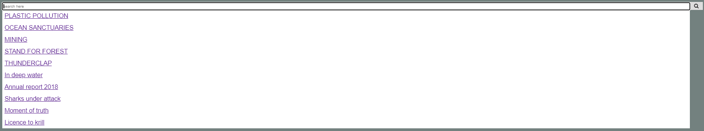
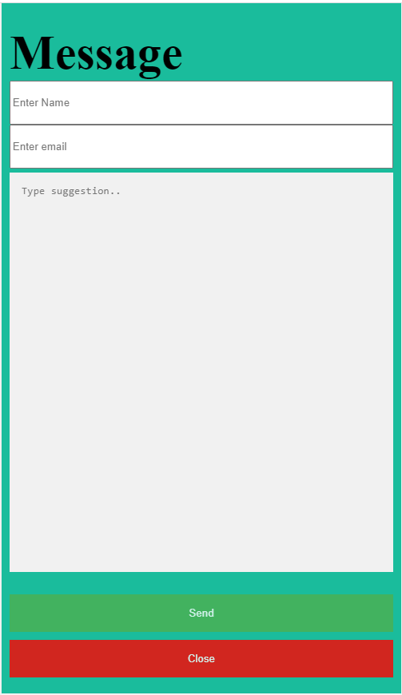
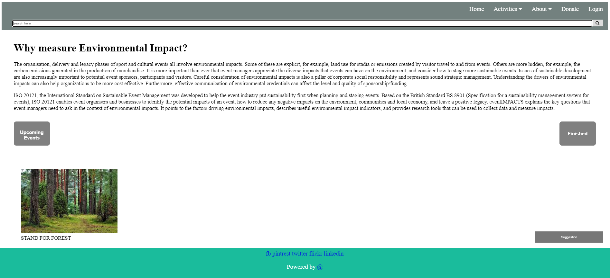
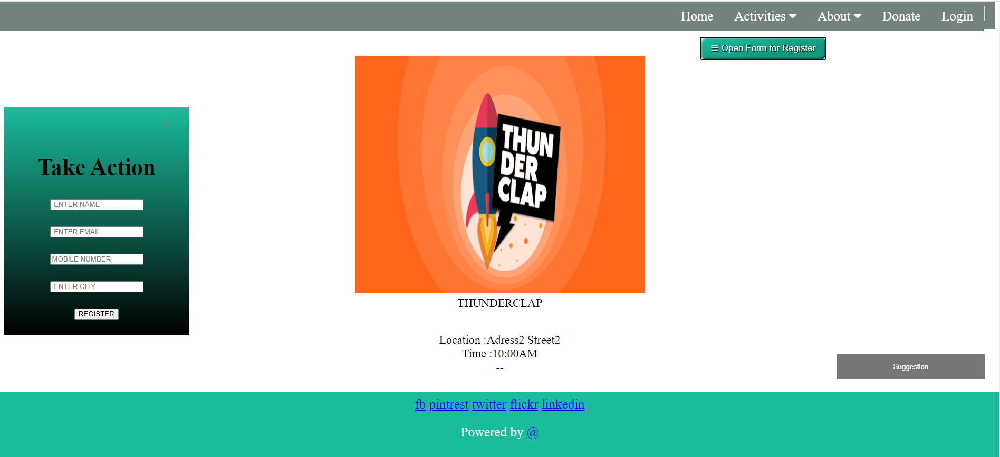

# NGO

Main function of our website are:
1) Search about campaign, event and article. 
2) Forget email option is provided.
3) It will tell about upcoming and finished event/campaigns.
4) Anyone with account can donate and can support in upcoming events/campaigns.
5) User can give suggestions.

Our website will load image dynamically.

#### Languages used:-
* Html  
* CSS   
* JavaScript
* Jquery
* NodeJs
* Database : MongoDb
 
### Screenshots
##### 1. Home page

##### 2. login

##### 3. signup

##### 4. About article

##### 5. Search bar

##### 6. Feedback

##### 7. Event

##### 8. Upcoming event Description

